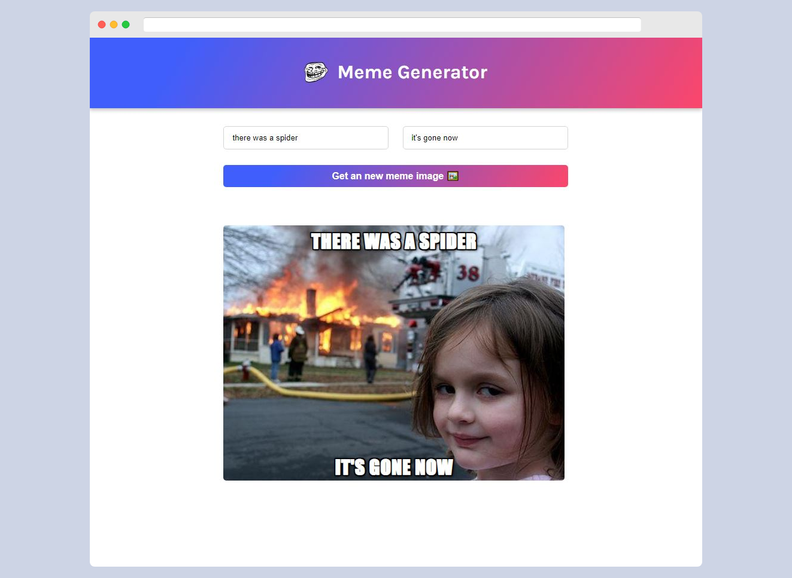

# tripscards

  

## Table of Contents

* [Description](#description)
* [React concepts](#react-concepts)
* [Technologies Used](#technologies-used)

## Description

Meme Generator is a fun and dynamic web app developed using React. This project was used to drive forward the React concepts that I have been learning so far.

When the app first loads, it will fetch the top most popular meme images from an API. The user can then edit an input form to add the top and bottom text of the meme image. The user can also fetch a random meme image with a click of a button.

## React concepts

The following are some of the topics that I learnt and implemented along the way:

- Organizing components
- Props vs state
- useState array destructing
- Local State
- React forms
- Forms state object
- Submitting forms in React
- useEffect
- Making API calls
- Async functions inside useEffect

## Technologies Used
- React
- HTML
- CSS
- Web API (Imgflip API)

## Author
[Jym Bocala](https://github.com/jymbocala)